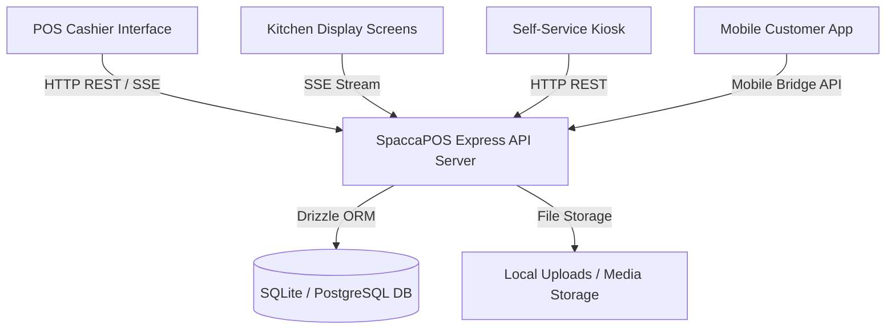
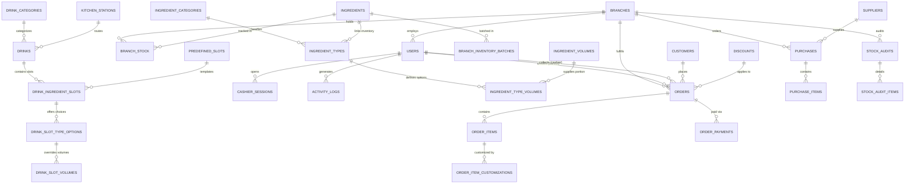
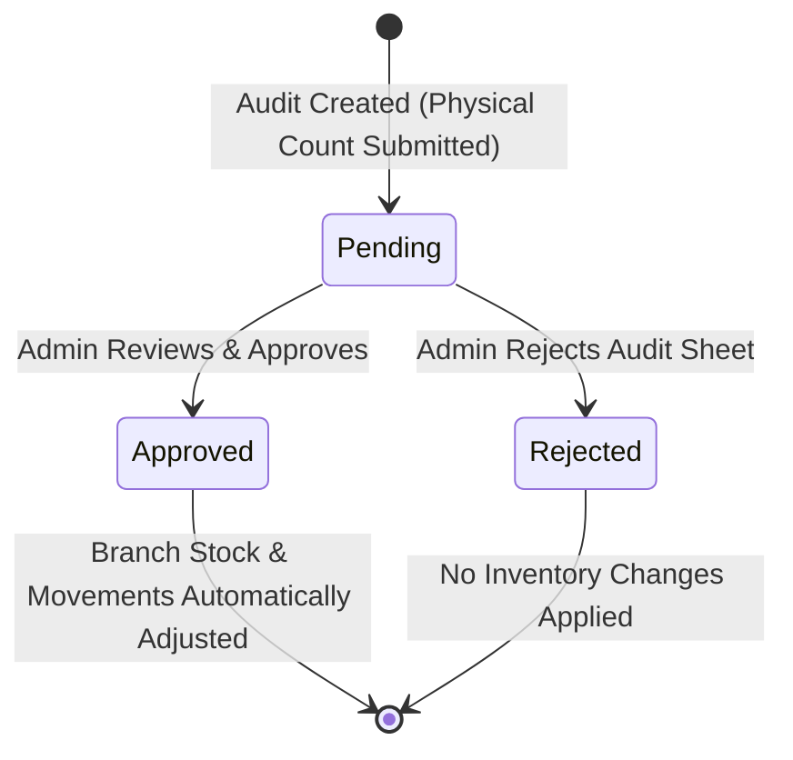

# 📄 Software Requirements Specification (SRS)
## SpaccaPOS — Advanced Coffee Shop Point-of-Sale & Inventory Ecosystem
**Version:** 2.0.0  
**Status:** Approved / Production Baseline  
**Date:** July 2026  
**Author:** Antigravity Senior Systems Architect & Engineering Team  

---

## 📋 Table of Contents
1. [Document Control & Overview](#1-document-control--overview)
2. [Introduction](#2-introduction)
   - 2.1 [Purpose](#21-purpose)
   - 2.2 [Scope](#22-scope)
   - 2.3 [Definitions & Acronyms](#23-definitions--acronyms)
3. [Overall Description](#3-overall-description)
   - 3.1 [Product Perspective](#31-product-perspective)
   - 3.2 [User Classes & Persona Hierarchy](#32-user-classes--persona-hierarchy)
   - 3.3 [Role-Based Access Control (RBAC) & Permission Matrix](#33-role-based-access-control-rbac--permission-matrix)
   - 3.4 [Operating Environment & Technology Stack](#34-operating-environment--technology-stack)
   - 3.5 [Design & Implementation Constraints](#35-design--implementation-constraints)
4. [System Architecture & Data Model](#4-system-architecture--data-model)
   - 4.1 [Monorepo Architecture Overview](#41-monorepo-architecture-overview)
   - 4.2 [Entity-Relationship Diagram (ERD)](#42-entity-relationship-diagram-erd)
   - 4.3 [Database Schema Specifications](#43-database-schema-specifications)
5. [Detailed Functional Requirements](#5-detailed-functional-requirements)
   - 5.1 [Module 1: Authentication & Shift Session Management](#51-module-1-authentication--shift-session-management)
   - 5.2 [Module 2: Dynamic Catalog & Multi-Tier Recipe Engine](#52-module-2-dynamic-catalog--multi-tier-recipe-engine)
   - 5.3 [Module 3: Point-of-Sale (POS) & Multi-Payment Processing](#53-module-3-point-of-sale-pos--multi-payment-processing)
   - 5.4 [Module 4: Kitchen Display System (KDS) & Multi-Station Routing](#54-module-4-kitchen-display-system-kds--multi-station-routing)
   - 5.5 [Module 5: Customer Self-Service Kiosk & Mobile Integration Bridge](#55-module-5-customer-self-service-kiosk--mobile-integration-bridge)
   - 5.6 [Module 6: Inventory Control, FEFO Batches & Stock Audit System](#56-module-6-inventory-control-fefo-batches--stock-audit-system)
   - 5.7 [Module 7: Supplier Management & Purchase Order (PO) Lifecycle](#57-module-7-supplier-management--purchase-order-po-lifecycle)
   - 5.8 [Module 8: Customer CRM & Loyalty Engine](#58-module-8-customer-crm--loyalty-engine)
   - 5.9 [Module 9: Financial Reporting, Shift Reconciliation & Analytics](#59-module-9-financial-reporting-shift-reconciliation--analytics)
   - 5.10 [Module 10: System Settings, Audit Logging & Security Administration](#510-module-10-system-settings-audit-logging--security-administration)
6. [External Interface Requirements](#6-external-interface-requirements)
   - 6.1 [User Interfaces](#61-user-interfaces)
   - 6.2 [Hardware Interfaces](#62-hardware-interfaces)
   - 6.3 [API Protocols & Real-Time Event Streaming (SSE)](#63-api-protocols--real-time-event-streaming-sse)
7. [Non-Functional Requirements (NFRs)](#7-non-functional-requirements-nfrs)
   - 7.1 [Performance & Latency](#71-performance--latency)
   - 7.2 [Security & Rate-Limiting](#72-security--rate-limiting)
   - 7.3 [Data Integrity & Transactional Isolation](#73-data-integrity--transactional-isolation)
   - 7.4 [Usability & Ergonomics](#74-usability--ergonomics)
8. [Requirements Traceability Matrix](#8-requirements-traceability-matrix)

---

## 1. Document Control & Overview

| Revision | Date | Description of Changes | Approved By |
| :--- | :--- | :--- | :--- |
| **1.0.0** | 2026-04-16 | Initial baseline functional requirements draft. | Product Owner |
| **1.5.0** | 2026-06-01 | Added FEFO Stock Batches, Predefined Slot Templates, and Split Payments. | Lead Architect |
| **2.0.0** | 2026-07-22 | Comprehensive system-wide review, full ERD mapping, KDS routing, and Mobile Bridge specification. | Technical Director |

---

## 2. Introduction

### 2.1 Purpose
This Software Requirements Specification (SRS) details the complete functional, non-functional, data model, architectural, and procedural requirements for the **SpaccaPOS Coffee Shop Point-of-Sale & Inventory Management System**. It serves as the definitive reference manual for developers, system administrators, quality assurance engineers, and operational management staff.

### 2.2 Scope
SpaccaPOS is an enterprise-grade multi-branch hospitality platform designed specifically for high-throughput coffee shop operations. The platform encompasses:
- **Desktop Point-of-Sale (POS)** for cashiers and baristas.
- **Kitchen Display System (KDS)** for real-time station-based drink preparation.
- **Self-Service Customer Kiosk** for contactless order placement.
- **Inventory & FEFO Batch Engine** with dynamic raw material deduction.
- **Stock Audit & Reconciliation Engine** with multi-level approval workflows.
- **Procurement & Supplier Management (PO System)**.
- **CRM & Customer Loyalty System**.
- **Financial Analytics, Cashier Shift Reconciliation & Reports**.
- **Mobile Application Integration Bridge** for customer mobile ordering.

### 2.3 Definitions & Acronyms
- **POS**: Point of Sale.
- **KDS**: Kitchen Display System.
- **FEFO**: First-Expired, First-Out (Inventory valuation & batch usage strategy).
- **RBAC**: Role-Based Access Control.
- **SSE**: Server-Sent Events (Real-time one-way HTTP streaming protocol).
- **PIN**: Personal Identification Number (6-digit authorization code for sensitive actions).
- **PO**: Purchase Order.
- **Slot**: A configurable recipe category for a drink (e.g., "Milk Choice", "Syrup Flavour", "Coffee Beans").
- **Type-Volume**: A composite entity binding a specific ingredient type (e.g., Oat Milk) to a portion volume (e.g., Medium 150ml) with price and inventory conversion overrides.

---

## 3. Overall Description

### 3.1 Product Perspective
SpaccaPOS operates as a centralized web application architecture backed by a Node.js/Express API server, an SQLite/PostgreSQL relational database managed via Drizzle ORM, and a Vite-powered React front-end client.



### 3.2 User Classes & Persona Hierarchy

| User Persona | Scope of Work | Primary Interfaces Used | Key Tasks & Objectives |
| :--- | :--- | :--- | :--- |
| **System Administrator** | Global / Multi-Branch | Admin Dashboard, Settings, Users | System config, user permissions, drink catalog engineering, overall financial audits. |
| **Store Supervisor** | Single Branch | Admin Panel, POS Cashier | High-privilege actions, approving stock audits, authorizing hospitality orders & refunds, PIN approvals. |
| **Cashier** | Single Branch | POS Interface, Shift Terminal | Open/close shifts, process customer orders, collect cash/card/wallet payments, issue receipts. |
| **Barista / Kitchen Staff** | Station Specific | Kitchen KDS Screen, Barista POS | Prepare drinks per station tickets, mark items/orders ready, request ingredient restocks. |
| **Inventory Manager** | Branch / Warehouse | Stock Control, Purchases | Record stock movements, log incoming PO receipts, manage suppliers, conduct physical stock audits. |
| **Customer** | Mobile / In-Store | Kiosk, Mobile Web Client | Browse catalog, customize drink recipes, place self-service orders, earn & redeem loyalty points. |

### 3.3 Role-Based Access Control (RBAC) & Permission Matrix

SpaccaPOS enforces high-granularity permission checks. Permissions can be assigned directly to roles or granted as individual user overrides.

```
Key System Permissions:
├─ pos:view                    (Access main POS interface)
├─ cashier:view               (Access cashier list & status)
├─ cashier:approve_order       (Confirm order payment & submit to kitchen)
├─ cashier:cancel_order        (Cancel active pending order)
├─ cashier:refund_order        (Process full/partial order refund)
├─ cashier:close_session       (End cashier shift session)
├─ cashier:view_reports        (View shift performance reports)
├─ kitchen:view                (Access Kitchen Display System)
├─ kitchen:mark_ready          (Bump order/item to Ready state)
├─ inventory:view              (View raw ingredient stock levels)
├─ inventory:adjust            (Perform manual stock adjustments/waste logs)
├─ inventory:audit             (Create and submit stock audit count sheets)
├─ inventory:approve_audit     (Approve stock audit variance adjustments)
├─ catalog:manage              (Create/Edit/Delete drinks, categories, recipes, slots)
├─ purchases:manage            (Create and process Purchase Orders & Suppliers)
├─ admin:view                  (Access System Settings, Users, Roles, Activity Logs)
```

| Permission Key | Admin | Supervisor | Cashier | Barista | Kitchen | Kiosk |
| :--- | :---: | :---: | :---: | :---: | :---: | :---: |
| `pos:view` | ✅ | ✅ | ✅ | ✅ | ❌ | ❌ |
| `cashier:approve_order` | ✅ | ✅ | ✅ | ❌ | ❌ | ❌ |
| `cashier:cancel_order` | ✅ | ✅ | ❌ (Req PIN) | ❌ | ❌ | ❌ |
| `cashier:refund_order` | ✅ | ✅ | ❌ (Req PIN) | ❌ | ❌ | ❌ |
| `cashier:close_session` | ✅ | ✅ | ✅ | ❌ | ❌ | ❌ |
| `cashier:view_reports` | ✅ | ✅ | ❌ (Own only) | ❌ | ❌ | ❌ |
| `kitchen:view` | ✅ | ✅ | ✅ | ✅ | ✅ | ❌ |
| `kitchen:mark_ready` | ✅ | ✅ | ✅ | ✅ | ✅ | ❌ |
| `inventory:view` | ✅ | ✅ | ✅ | ✅ | ❌ | ❌ |
| `inventory:adjust` | ✅ | ✅ | ❌ | ❌ | ❌ | ❌ |
| `inventory:audit` | ✅ | ✅ | ✅ | ❌ | ❌ | ❌ |
| `inventory:approve_audit` | ✅ | ❌ | ❌ | ❌ | ❌ | ❌ |
| `catalog:manage` | ✅ | ❌ | ❌ | ❌ | ❌ | ❌ |
| `purchases:manage` | ✅ | ✅ | ❌ | ❌ | ❌ | ❌ |
| `admin:view` | ✅ | ❌ | ❌ | ❌ | ❌ | ❌ |

### 3.4 Operating Environment & Technology Stack
- **Frontend Stack**: React 19, TypeScript, Tailwind CSS v4, Lucide Icons, Framer Motion, TanStack Query v5.
- **Backend Stack**: Node.js v20+, Express.js, Drizzle ORM, Zod v3.25 validation, Bcrypt password hashing.
- **Database Engine**: SQLite (Production/Development embedded) or PostgreSQL.
- **Real-Time Layer**: Server-Sent Events (SSE) broadcasting over persistent HTTP connections.
- **Supported OS/Browsers**: Windows 10/11, macOS, Linux, Chrome 110+, Edge 110+, Safari 16+, Android Tablet Chrome.

---

## 4. System Architecture & Data Model

### 4.1 Monorepo Architecture Overview
The codebase is structured as a pnpm workspace:
- `artifacts/spacca-pos`: Web Frontend Application.
- `artifacts/api-server`: Express Backend API Server.
- `lib/db`: Database schemas, migrations, seeders, and Drizzle config.
- `lib/api-spec` & `lib/api-zod`: OpenAPI spec definitions and Zod schemas.
- `lib/api-client-react`: Auto-generated React Query API client.

### 4.2 Entity-Relationship Diagram (ERD)



### 4.3 Database Schema Specifications

The database consists of **35 database tables**. Key core schemas are detailed below:

#### 1. `users` Table
Stores system staff, admins, cashiers, baristas, and supervisors.
- `id` (Serial, Primary Key)
- `branch_id` (Integer, Nullable FK to `branches.id`)
- `name` (Text, Required)
- `username` (Varchar(50), Unique)
- `password_hash` (Text, Bcrypt encrypted)
- `role` (Text, Default "barista", Enum: `admin`, `supervisor`, `cashier`, `barista`, `kitchen`)
- `pin` (Varchar(6), Optional 6-digit numeric override code)
- `is_active` (Boolean, Default `true`)
- `created_at`, `updated_at` (Timestamps with Timezone)

#### 2. `drinks` Table
Master catalog of sellable beverages and products.
- `id` (Serial, Primary Key)
- `name` (Text, Required)
- `description` (Text, Optional)
- `category` (Text, Required string)
- `category_id` (Integer, FK to `drink_categories.id`)
- `basePrice` (Numeric(8,2), Base retail price)
- `imageUrl` (Text, Relative path to uploaded image)
- `sortOrder` (Integer, Default 0)
- `isActive` (Boolean, Default `true`)
- `prepTimeSeconds` (Integer, Default 180)
- `cupSizeMl` (Integer, Required cup volume in ml)
- `cupIngredientId` (Integer, FK to `ingredients.id` for automated cup inventory deduction)
- `isCustomizable` (Boolean, Default `true`)
- `kitchenStation` (Text, Default "main")
- `kitchenStationId` (Integer, FK to `kitchen_stations.id`)

#### 3. `drink_ingredient_slots` Table
Defines recipe slots per drink (e.g. Milk, Bean Origin, Syrup).
- `id` (Serial, Primary Key)
- `drink_id` (Integer, FK to `drinks.id` ON DELETE CASCADE)
- `ingredient_type_id` (Integer, FK to `ingredient_types.id`)
- `slot_label` (Text, Display name on POS/Kiosk)
- `is_required` (Boolean, Default `true`)
- `is_dynamic` (Boolean, Default `false`)
- `sort_order` (Integer, Default 0)
- `barista_sort_order`, `customer_sort_order` (Integer, Default 1)
- `affects_cup_size` (Boolean, Optional override)
- `predefined_slot_id` (Integer, Optional FK to `predefined_slots.id` template)

#### 4. `orders` Table
Master transactional order record.
- `id` (Serial, Primary Key)
- `branch_id` (Integer, FK to `branches.id`)
- `order_number` (Text, Unique format: `{branchId}-{dayOfYear}{serial3Digits}`)
- `barista_id` (Integer, FK to `users.id` - creator)
- `cashier_id` (Integer, FK to `users.id` - payment collector)
- `status` (Text, Enum: `pending`, `paid`, `in_progress`, `ready`, `completed`, `cancelled`, `refunded`)
- `customer_name` (Text, Optional)
- `customer_phone` (Text, Optional)
- `subtotal` (Numeric(8,2), Total before discounts)
- `discount` (Numeric(8,2), Total discount applied)
- `discount_id` (Integer, FK to `discounts.id`)
- `discount_code` (Text, Optional)
- `discount_value` (Numeric(8,2))
- `discount_type` (Text, Enum: `percentage`, `fixed`, `fixed_per_item`)
- `total` (Numeric(8,2), Final payable amount)
- `payment_method` (Text, Enum: `cash`, `card`, `wallet`, `hospitality`, `split`, `refund`)
- `source` (Text, Enum: `pos`, `kiosk`, `web`, `mobile`)
- `amount_tendered` (Numeric(8,2))
- `change_due` (Numeric(8,2))
- `notes` (Text, Special order instructions)
- `paid_at`, `ready_at`, `completed_at`, `cancelled_at` (Timestamps)

#### 5. `branch_stock` Table
Branch-specific raw material inventory levels.
- `branch_id` (Integer, Primary Key Component 1)
- `ingredient_id` (Integer, Primary Key Component 2)
- `stock_quantity` (Numeric(12,4), Current available balance)
- `startup_quantity` (Numeric(12,4), Opening balance)
- `low_stock_threshold` (Numeric(12,4), Warning threshold, Default 500)

#### 6. `branch_inventory_batches` Table
FEFO inventory batch tracking.
- `id` (Serial, Primary Key)
- `branch_id` (Integer, FK to `branches.id`)
- `ingredient_id` (Integer, FK to `ingredients.id`)
- `batch_number` (Text)
- `sealed_expiry_date` (Timestamp, Expiration date while sealed)
- `expiry_date` (Timestamp, Effective expiration date)
- `is_opened` (Boolean, Default `false`)
- `opened_at` (Timestamp, Time when container was opened)
- `quantity` (Numeric(12,4), Remaining batch stock)
- `initial_quantity` (Numeric(12,4), Starting batch volume)

---

## 5. Detailed Functional Requirements

### 5.1 Module 1: Authentication & Shift Session Management

#### REQ-AUTH-01: User Authentication
- The system **shall** authenticate staff via username and password or 6-digit numeric PIN.
- Failed login attempts **shall** be rate-limited to 10 attempts per 15 minutes per IP address.
- Successfully authenticated user details, assigned branch ID, and resolved permission keys **shall** be stored in an encrypted HTTP-only session cookie.

#### REQ-AUTH-02: Cashier Shift Sessions
- A Cashier **must** explicitly initiate a Shift Session (`POST /cashier/login`) before processing transactions on the POS.
- The system **shall** prevent closing a session (`POST /cashier/end-session`) unless the user possesses the `cashier:close_session` permission.
- Upon shift closure, the system **shall** generate a Shift Performance Summary breaking down total orders, total revenue, cash revenue, card revenue, digital wallet revenue, hospitality order value, and category sales breakdown.

#### REQ-AUTH-03: Sensitive Action PIN Authorization
- High-risk operations (processing order refunds, applying hospitality 100% discounts, overriding out-of-stock limits, approving stock audits) **shall** trigger an inline PIN modal.
- The system **shall** verify the submitted PIN (`POST /auth/verify-pin`) against active users with `admin`, `supervisor`, or `cashier` roles.

---

### 5.2 Module 2: Dynamic Catalog & Multi-Tier Recipe Engine

```
Recipe Hierarchy Architecture:
DRINK (e.g. Iced Cafe Latte)
  ├── CUP INGREDIENT (e.g. 16oz Clear Plastic Cup -> -1 pcs)
  ├── SLOT 1: Coffee Beans (Required)
  │     ├── Type Option A: Brazilian Roast (Extra EGP 0) -> Volume: Double Shot (18g coffee)
  │     └── Type Option B: Ethiopian Single Origin (Extra EGP 15) -> Volume: Double Shot (18g coffee)
  └── SLOT 2: Milk Choice (Required)
        ├── Type Option A: Whole Fresh Milk (Extra EGP 0) -> Volume: 200ml
        ├── Type Option B: Oat Milk (Extra EGP 20) -> Volume: 200ml
        └── Type Option C: Almond Milk (Extra EGP 25) -> Volume: 200ml
```

#### REQ-CAT-01: Drink Recipe & Slot Architecture
- The system **shall** support multi-tier recipe configurations. Each drink consists of base price, cup volume, cup ingredient ID, prep time, assigned kitchen station, and one or more Recipe Slots.
- Recipe slots **shall** support soft-inheritance from **Predefined Slot Templates** (e.g. "Standard Milk Choice", "Sugar Levels") to allow administrative bulk updating of options across multiple drinks.

#### REQ-CAT-02: Dynamic Price Calculation
- The system **shall** compute total drink prices dynamically:
  $$\text{Total Drink Price} = \text{Base Price} + \sum (\text{Type Extra Cost}) + \sum (\text{Volume Extra Cost})$$
- The calculation engine **shall** validate that all required slots have valid selections and evaluate real-time raw material inventory availability for the active branch.

#### REQ-CAT-03: Out-of-Stock Auto-Badging
- If any required slot option or required cup ingredient has zero stock balance in `branch_stock` for the current branch, the system **shall** automatically flag the drink as `Out of Stock` with detailed unavailable reasons (e.g. `"Out of stock: Oat Milk"`).

---

### 5.3 Module 3: Point-of-Sale (POS) & Multi-Payment Processing

#### REQ-POS-01: Order Number Generation
- The system **shall** generate deterministic, collision-free order numbers using explicit row-level locking (`SELECT ... FOR UPDATE`) on the branch record:
  $$\text{Order Number} = \text{BranchID} - \text{DayOfYear} + \text{Serial3Digits} \quad (\text{e.g., } 1-203004)$$

#### REQ-POS-02: Multi-Payment & Split Payment Handling
- The POS **shall** accept multiple payment methods for a single order transaction:
  - **Cash**: Tracks `amountTendered` and calculates `changeDue`.
  - **Card**: Logs electronic POS terminal transaction ID.
  - **Wallet**: Supports Vodafone Cash, InstaPay, and digital wallets.
  - **Hospitality**: 100% discount for guests/management; **requires** Admin PIN authorization.
  - **Split Payment**: Allows dividing an order total across multiple payment methods (e.g., EGP 50 Cash + EGP 100 Card).

#### REQ-POS-03: Promotional Discount Engine
- The system **shall** evaluate promotional discount codes matching three types:
  1. `percentage`: Applies percentage off subtotal (calculated before 14% tax).
  2. `fixed`: Applies fixed currency deduction.
  3. `fixed_per_item`: Multiplies fixed deduction by total item count.
- Discounts **shall** never reduce order total below EGP 0.00.

#### REQ-POS-04: Atomic Stock Deduction & Order Confirmation
- When an order transitions from `pending` to a confirmed status (`paid`, `in_progress`, `ready`, `completed`), the system **shall** inside a single database transaction:
  1. Calculate exact consumed ingredient quantities for all items and customizations.
  2. Deduct quantities from `branch_stock`.
  3. Deduct quantities from `branch_inventory_batches` using First-Expired, First-Out (FEFO) logic.
  4. Write `stock_movements` records with movement type `"sale"`.
  5. Broadcast an `order_created` event via Server-Sent Events (SSE).

---

### 5.4 Module 4: Kitchen Display System (KDS) & Multi-Station Routing

#### REQ-KDS-01: Kitchen Station Routing
- Each drink item **shall** be assigned to a Kitchen Station (e.g. `espresso-bar`, `cold-drinks`, `bakery`, `kitchen`).
- KDS screens **shall** filter incoming orders based on the active station selected by kitchen staff.

#### REQ-KDS-02: Item-Level & Order-Level Bumping
- Kitchen staff **shall** be able to mark individual order items as `Ready` (`PATCH /order-items/:id/ready`).
- When all items within an order are marked `Ready`, the system **shall** automatically transition the master order status to `ready` and broadcast an SSE update to the POS Pickup Screen.

---

### 5.5 Module 5: Customer Self-Service Kiosk & Mobile Integration Bridge

#### REQ-KSK-01: Kiosk Mode
- The system **shall** provide an unauthenticated, touch-optimized Self-Service Kiosk interface (`/kiosk`).
- Kiosk orders **shall** default to `source = "kiosk"` and automatically route to the kitchen upon payment.

#### REQ-KSK-02: Mobile Bridge API Architecture
- The system **shall** expose a Magento/Bagisto compatible Mobile Bridge API (`/api/mobile/*`) to support native mobile application clients without altering mobile UI contracts:
  - `GET /getAllCategories`: Returns category tree.
  - `GET /products/getProductsByCategory`: Returns paginated product cards.
  - `POST /products/getProductIdByOptions`: Resolves custom slot combinations into encoded variant keys.
  - `POST /checkout/onepage/orders`: Converts mobile cart sessions into transactional SpaccaPOS orders.

---

### 5.6 Module 6: Inventory Control, FEFO Batches & Stock Audit System

#### REQ-INV-01: Inventory Tracking & Unit Conversions
- Raw inventory items **shall** support base units (e.g. `Grams`, `ML`, `PCS`) and purchase unit conversions (e.g., 1 KG Bag = 1,000 Grams; 1 Box = 12 Packets).

#### REQ-INV-02: FEFO (First-Expired, First-Out) Batch Deductions
- Stock deductions **shall** consume inventory from `branch_inventory_batches` ordered by `expiry_date ASC`.
- When an unopened package batch is first accessed for deduction, the system **shall** mark `is_opened = true`, set `opened_at = now()`, and recalculate `expiry_date` using the ingredient's `opened_shelf_life_days`.

#### REQ-INV-03: Stock Audit & Reconciliation Workflow

- Store staff **shall** submit physical stock count audits (`POST /stock-audits`).
- Upon Admin approval (`POST /stock-audits/:id/approve`), the system **shall** automatically calculate variance ($\text{Variance} = \text{Actual} - \text{Expected}$), adjust `branch_stock`, write `"adjustment"` stock movement records, and record the approving Admin's user ID.

---

### 5.7 Module 7: Supplier Management & Purchase Order (PO) Lifecycle

#### REQ-PUR-01: Purchase Order Lifecycle
- The system **shall** manage Purchase Orders across 4 strict statuses: `draft` $\rightarrow$ `ordered` $\rightarrow$ `received` $\rightarrow$ `cancelled`.
- When a PO is marked as `received` (`PATCH /purchases/:id/status`), the system **shall**:
  1. Increment `branch_stock` by the converted unit quantities.
  2. Create new inventory batches in `branch_inventory_batches` with batch numbers and expiry dates.
  3. Log `"restock"` movements in `stock_movements`.
  4. Update PO `payment_status` (`unpaid`, `partially_paid`, `paid`).

---

### 5.8 Module 8: Customer CRM & Loyalty Engine

#### REQ-CRM-01: Customer Profile & Phone Lookup
- The POS **shall** allow searching customers by phone number or name.
- Non-registered phone numbers entered at checkout **shall** attach to the order without blocking transaction flow.

#### REQ-CRM-02: Loyalty Points Accumulation
- For registered active customers, order confirmation **shall** automatically award loyalty points:
  $$\text{Points Earned} = \left\lfloor \frac{\text{Order Total (Excl. Tax)}}{10} \right\rfloor$$
- Customer `totalSpent` and `visitCount` **shall** atomically increment inside the order creation transaction.

---

### 5.9 Module 9: Financial Reporting, Shift Reconciliation & Analytics

#### REQ-REP-01: Financial Analytics Dashboard
- The system **shall** provide analytical reporting over custom date ranges and branch filters:
  - **Gross & Net Revenue** (before and after tax/discounts).
  - **Cost of Goods Sold (COGS)** calculated from precise ingredient cost totals.
  - **Net Gross Profit Margin Percentage**.
  - **Payment Method Revenue Distribution** (Cash vs Card vs Wallet vs Hospitality).
  - **Hourly Rush Analysis** (Order density per hour of the day).
  - **Category & Item Popularity Matrix** (Top 5 selling drinks by volume and revenue).

---

### 5.10 Module 10: System Settings, Audit Logging & Security Administration

#### REQ-ADM-01: System Configuration
- Admins **shall** manage global settings stored as JSON values in `settingsTable`:
  - `allowNoStockSell` (`"true"` / `"false"`): Toggles whether POS allows selling drinks when ingredient stock is zero.
  - `autoPrintReceipt` (`"true"` / `"false"`).
  - `vatPercentage` (Default `14.0`).

#### REQ-ADM-02: Immutable Activity Logs
- All administrative, financial, stock adjustment, and authentication events **shall** write an entry to `activity_logsTable` containing `userId`, `action`, `entityType`, `entityId`, `ipAddress`, and structured JSON `details`.

---

## 6. External Interface Requirements

### 6.1 User Interfaces
- **POS Screen**: Touch-optimized 1080p layout with category sidebar, product grid, customization modal, customer lookup banner, and split-payment checkout drawer.
- **KDS Screen**: Dark-mode high-contrast grid displaying live order cards timer-colored (Green $< 3$ mins, Yellow $3-5$ mins, Red $> 5$ mins).

### 6.2 Hardware Interfaces
- **Thermal Receipt Printers**: Support ESC/POS standard USB/Network thermal printers (80mm width) for automated customer receipts and kitchen order slips.
- **Cash Drawer**: Trigger 24V pulse via RJ11 receipt printer port on cash transaction approval.

### 6.3 API Protocols & Real-Time Event Streaming (SSE)
- **REST Endpoints**: JSON payloads over HTTPS with HTTP status codes (`200 OK`, `201 Created`, `400 Bad Request`, `401 Unauthorized`, `403 Forbidden`, `409 Conflict`, `429 Too Many Requests`).
- **Real-Time Streaming**: `/api/events` endpoint utilizing Server-Sent Events (SSE) emitting `order_created`, `order_updated`, `inventory_updated`, and `shift_closed` event channels.

---

## 7. Non-Functional Requirements (NFRs)

### 7.1 Performance & Latency
- **NFR-PERF-01**: POS Order Submission endpoint (`POST /orders`) **shall** process complete transactions (including stock validation and DB writes) within **$< 150\text{ ms}$** under normal load.
- **NFR-PERF-02**: Real-time SSE order broadcast to KDS screens **shall** deliver events within **$< 50\text{ ms}$** of transaction commit.

### 7.2 Security & Rate-Limiting
- **NFR-SEC-01**: All user passwords **shall** be hashed using Bcrypt with a minimum work factor of 10.
- **NFR-SEC-02**: API login endpoints **shall** enforce rate limiting (10 attempts / 15 mins).
- **NFR-SEC-03**: All SQL queries **shall** utilize parameter binding via Drizzle ORM to prevent SQL Injection vulnerabilities.

### 7.3 Data Integrity & Transactional Isolation
- **NFR-DAT-01**: Multi-table state changes (Order creation + Stock deduction + Batch update + Loyalty points) **must** execute within an explicit ACID database transaction (`db.transaction()`).

---

## 8. Requirements Traceability Matrix

| Requirement ID | Module | Implementation File / Endpoint | Verification Method |
| :--- | :--- | :--- | :--- |
| **REQ-AUTH-01** | Authentication | `artifacts/api-server/src/routes/auth.ts` | Automated Integration Test |
| **REQ-AUTH-02** | Cashier Shift | `artifacts/api-server/src/routes/cashier-sessions.ts` | Manual / Automated Test |
| **REQ-CAT-02** | Price Engine | `artifacts/api-server/src/lib/price-calculator.ts` | Unit Tests |
| **REQ-POS-01** | Order Numbers | `artifacts/api-server/src/routes/orders.ts#generateOrderNumber` | Load Test (Concurrency) |
| **REQ-POS-04** | Stock Deduction | `artifacts/api-server/src/routes/orders.ts` & `stock-utils.ts` | Database Inspection |
| **REQ-INV-02** | FEFO Batches | `artifacts/api-server/src/lib/stock-utils.ts` | Unit Tests |
| **REQ-KDS-02** | Order Bump | `artifacts/api-server/src/routes/orders.ts#ready` | Browser E2E Test |
| **REQ-KSK-02** | Mobile Bridge | `artifacts/api-server/src/routes/mobile-bridge.ts` | Postman API Test |
| **REQ-REP-01** | Analytics | `artifacts/api-server/src/routes/finance.ts` | Report Audit |
