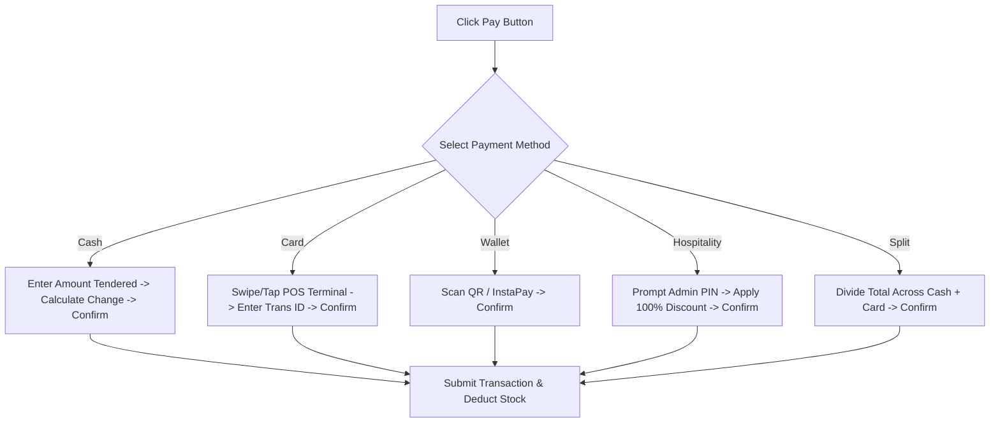
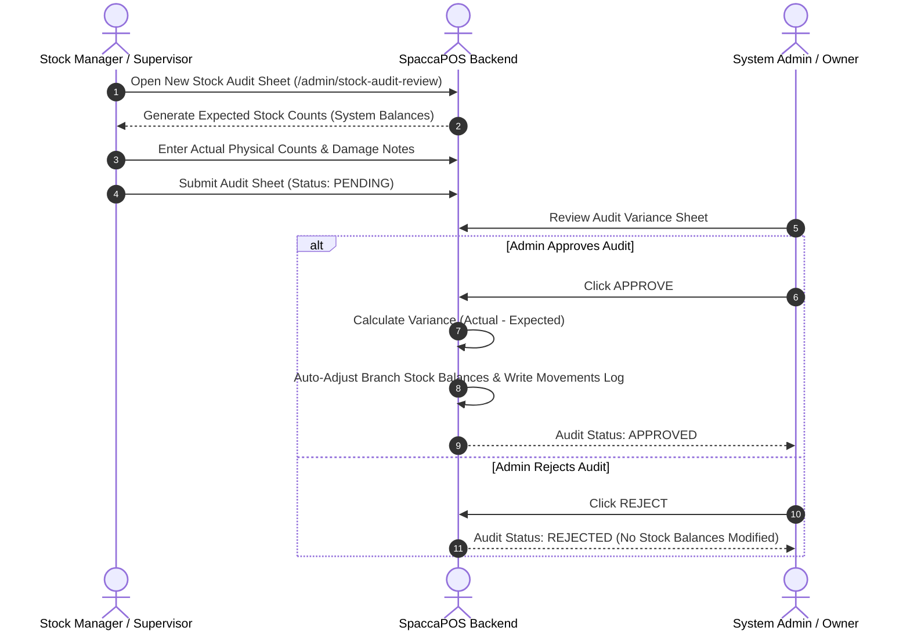

# 📖 SpaccaPOS User & Staff Operational Training Manual
**Complete Operational Guide for Cashiers, Baristas, Kitchen Staff, Inventory Managers & Administrators**  
**Version:** 2.0.0  
**Target Platform:** SpaccaPOS Coffee Shop Point-of-Sale Ecosystem  

---

## 📘 Welcome to SpaccaPOS
SpaccaPOS is designed to make your daily coffee shop operations fast, efficient, and error-free. Whether you are taking orders at the front counter, preparing craft beverages at the espresso station, managing raw inventory in the backroom, or analyzing daily sales reports, this manual provides clear step-by-step instructions.

---

## 📋 Table of Contents
1. [Quick Access & Navigation Guide](#1-quick-access--navigation-guide)
2. [Module 1: Cashier & POS Front-of-House Operations](#2-module-1-cashier--pos-front-of-house-operations)
   - 2.1 [Starting Your Shift (Cashier Login)](#21-starting-your-shift-cashier-login)
   - 2.2 [Navigating the POS Interface](#22-navigating-the-pos-interface)
   - 2.3 [Taking a Standard Drink Order](#23-taking-a-standard-drink-order)
   - 2.4 [Customizing Drinks (Milk, Coffee Beans, Syrups, Sizes)](#24-customizing-drinks-milk-coffee-beans-syrups-sizes)
   - 2.5 [Applying Promo Codes & Discounts](#25-applying-promo-codes--discounts)
   - 2.6 [Customer CRM & Loyalty Points Lookup](#26-customer-crm--loyalty-points-lookup)
   - 2.7 [Processing Payments (Cash, Card, Wallet, Hospitality, Split)](#27-processing-payments-cash-card-wallet-hospitality-split)
   - 2.8 [Printing Receipts & Esc/POS Thermal Printer Setup](#28-printing-receipts--escpos-thermal-printer-setup)
   - 2.9 [Handling Order Cancellations & Refunds](#29-handling-order-cancellations--refunds)
   - 2.10 [Closing Your Shift & Printing End-of-Shift Reports](#210-closing-your-shift--printing-end-of-shift-reports)
3. [Module 2: Barista & Kitchen Display System (KDS) Operations](#3-module-2-barista--kitchen-display-system-kds-operations)
   - 3.1 [Accessing the KDS Interface](#31-accessing-the-kds-interface)
   - 3.2 [Selecting Your Kitchen Station](#32-selecting-your-kitchen-station)
   - 3.3 [Understanding Ticket Color Timers & Priority](#33-understanding-ticket-color-timers--priority)
   - 3.4 [Reading Custom Recipe Slots & Barista Preparation Guides](#34-reading-custom-recipe-slots--barista-preparation-guides)
   - 3.5 [Bumping Items & Completing Orders](#35-bumping-items--completing-orders)
   - 3.6 [Customer Order Pickup Screen Display](#36-customer-order-pickup-screen-display)
4. [Module 3: Self-Service Customer Kiosk Guide](#4-module-3-self-service-customer-kiosk-guide)
   - 4.1 [Kiosk Mode Setup](#41-kiosk-mode-setup)
   - 4.2 [Customer Self-Ordering & Recipe Customization](#42-customer-self-ordering--recipe-customization)
5. [Module 4: Stock, Inventory & Procurement Management](#5-module-4-stock-inventory--procurement-management)
   - 5.1 [Monitoring Live Branch Stock Levels](#51-monitoring-live-branch-stock-levels)
   - 5.2 [FEFO Inventory Batches & Expiration Tracking](#52-fefo-inventory-batches--expiration-tracking)
   - 5.3 [Logging Stock Adjustments & Waste Records](#53-logging-stock-adjustments--waste-records)
   - 5.4 [Conducting Physical Stock Audits & Count Sheets](#54-conducting-physical-stock-audits--count-sheets)
   - 5.5 [Managing Suppliers & Purchase Orders (PO Lifecycle)](#55-managing-suppliers--purchase-orders-po-lifecycle)
6. [Module 5: Admin Control Panel & Branch Management](#6-module-5-admin-control-panel--branch-management)
   - 6.1 [Managing Staff Accounts, Roles & 6-Digit PINs](#61-managing-staff-accounts-roles--6-digit-pins)
   - 6.2 [Designing Drink Catalogs & Categories](#62-designing-drink-catalogs--categories)
   - 6.3 [Building Custom Recipe Slots & Predefined Templates](#63-building-custom-recipe-slots--predefined-templates)
   - 6.4 [Configuring Kitchen Stations & Routing Rules](#64-configuring-kitchen-stations--routing-rules)
   - 6.5 [Reviewing & Approving Stock Audits](#65-reviewing--approving-stock-audits)
   - 6.6 [Financial Business Intelligence & Performance Reports](#66-financial-business-intelligence--performance-reports)
7. [Troubleshooting & FAQs](#7-troubleshooting--faqs)

---

## 1. Quick Access & Navigation Guide

### System URL Map

| Module Interface | Web Access URL | Primary Roles |
| :--- | :--- | :--- |
| **Main Login Screen** | `/login` | All Staff |
| **POS Cashier Terminal** | `/pos` or `/cashier` | Cashiers, Baristas, Supervisors |
| **Kitchen Display System** | `/kitchen` | Baristas, Kitchen Staff |
| **Customer Pickup Display** | `/pickup` | Customers, Baristas |
| **Self-Service Kiosk** | `/kiosk` | Customers |
| **Stock & Inventory** | `/stock-control` or `/admin/stock` | Stock Managers, Admins |
| **Admin Control Center** | `/admin` | Store Managers, System Admins |

---

## 2. Module 1: Cashier & POS Front-of-House Operations

### 2.1 Starting Your Shift (Cashier Login)
Before processing any customer transactions, a cashier **must** initiate an active shift session.

```
Step-by-Step Shift Start:
1. Open your browser and navigate to /cashier.
2. Enter your assigned Username and Password.
3. Click "Start Shift".
4. The system validates your credentials and registers your IP Address and active Cashier Session ID.
5. You are automatically taken to the active POS register screen.
```

> [!NOTE]
> Multiple devices in the same branch can run under the active shift session without creating duplicate login conflicts.

---

### 2.2 Navigating the POS Interface

```
┌────────────────────────────────────────────────────────────────────────────────────────┐
│ ☕ SpaccaPOS | Branch: Main Downtown | Cashier: Sarah M. | Shift Active                │
├──────────────────────┬─────────────────────────────────────────┬───────────────────────┤
│ CATEGORIES           │ DRINK SELECTION GRID                    │ CURRENT ORDER CART    │
│ 🔘 All Drinks        │ ┌───────────────┐ ┌───────────────┐     │ Order #1-203004       │
│ ☕ Espresso Bar      │ │ Iced Latte    │ │ Spanish Latte │     │ ───────────────────── │
│ 🧊 Cold Beverages    │ │ EGP 85.00     │ │ EGP 95.00     │     │ 1x Iced Latte EGP 105 │
│ 🥐 Bakery & Pastry   │ └───────────────┘ └───────────────┘     │   + Oat Milk (+EGP 20)│
│ 🍵 Specialty Teas    │ ┌───────────────┐ ┌───────────────┐     │ ───────────────────── │
│                      │ │ V60 Drip      │ │ Matcha Latte  │     │ Subtotal:  EGP 105.00 │
│ CUSTOMER CRM         │ │ EGP 110.00    │ │ EGP 90.00     │     │ Discount:  EGP   0.00 │
│ 🔍 Phone: 010123...  │ └───────────────┘ └───────────────┘     │ TOTAL:     EGP 105.00 │
│ [Points: 140 pts]    │                                         │ [ PAY / CHECKOUT ]    │
└──────────────────────┴─────────────────────────────────────────┴───────────────────────┘
```

- **Category Sidebar (Left)**: Filter beverages by drink category.
- **Product Grid (Center)**: Visual drink buttons with real-time price and `Out of Stock` indicators.
- **Order Cart (Right)**: Displays selected items, customized options, subtotal, discounts, and checkout button.

---

### 2.3 Taking a Standard Drink Order
1. Click on any drink card (e.g. *Iced Flat White*) in the product grid.
2. If the drink is not customizable, it will immediately add to the cart on the right.
3. To increase quantity, click the item again or use the `+` button in the cart drawer.

---

### 2.4 Customizing Drinks (Milk, Coffee Beans, Syrups, Sizes)
If a drink has customizable recipe slots, clicking it opens the **Drink Customization Sheet**:

```
 ┌──────────────────────────────────────────────────────────┐
 │ Customize: Iced Cafe Latte                               │
 ├──────────────────────────────────────────────────────────┤
 │ 🥛 Milk Choice (Required)                                │
 │   [*] Whole Fresh Milk (+EGP 0)                          │
 │   [ ] Oat Milk (+EGP 20)                                 │
 │   [ ] Almond Milk (+EGP 25)                              │
 ├──────────────────────────────────────────────────────────┤
 │ 🫘 Coffee Beans Origin (Required)                       │
 │   [*] House Espresso Blend (+EGP 0)                      │
 │   [ ] Ethiopian Single Origin (+EGP 15)                 │
 ├──────────────────────────────────────────────────────────┤
 │ 🧪 Portion / Volume                                      │
 │   [ ] Single Shot (100ml)                                │
 │   [*] Double Shot (200ml) (+EGP 10)                      │
 ├──────────────────────────────────────────────────────────┤
 │ 📝 Special Instructions: [ Extra Ice, Low Sugar        ] │
 ├──────────────────────────────────────────────────────────┤
 │ [ Cancel ]                             [ Add to Order ]  │
 └──────────────────────────────────────────────────────────┘
```

1. Select option pills for required slots (e.g. Milk choice, Coffee bean origin).
2. Select optional additions (extra syrup pumps, whipped cream, sweetener).
3. Type custom customer notes if applicable (e.g., "Extra hot", "In customer thermo mug").
4. Click **Add to Order**. The computed price update is reflected immediately in the cart.

---

### 2.5 Applying Promo Codes & Discounts
1. In the Cart Drawer, click **Apply Discount / Promo Code**.
2. Enter the promo code (e.g. `WELCOME10` or `STAFF50`) or select an active predefined discount.
3. The system validates the code:
   - **Percentage**: Deducts percentage from subtotal (pre-tax).
   - **Fixed Amount**: Deducts lump sum amount.
   - **Fixed Per Item**: Deducts amount multiplied by total item count.
4. The discount line total updates instantly.

---

### 2.6 Customer CRM & Loyalty Points Lookup
1. In the top left CRM panel, type the customer's phone number (e.g. `01012345678`).
2. If registered, the customer's name and **Loyalty Points Balance** appear.
3. If not registered, typing the phone number links it to the order so the customer receives SMS order alerts.
4. Registered customers earn **1 Loyalty Point for every EGP 10 spent**.

---

### 2.7 Processing Payments

Click **Checkout / Pay** to open the Payment Modal. SpaccaPOS supports 5 payment methods:



#### 1. Cash Payment
- Enter the Cash Tendered amount (e.g. Customer gives EGP 200 for an EGP 135 bill).
- The screen automatically displays **Change Due: EGP 65.00**.
- Click **Complete Order**. The cash drawer opens automatically.

#### 2. Card Payment
- Process card payment on your physical terminal.
- Enter the optional terminal reference code.
- Click **Complete Order**.

#### 3. Hospitality Payment (Guest / Management Courtesy)
- Select **Hospitality**.
- The system prompts for an **Admin / Supervisor PIN**.
- Enter a valid 6-digit PIN. The order subtotal is discounted 100% (Total: EGP 0.00).

#### 4. Split Payment
- Select **Split Payment**.
- Specify amount for Payment Method 1 (e.g. EGP 50 Cash).
- Specify amount for Payment Method 2 (e.g. EGP 85 Card).
- Click **Complete Order** once the full balance is satisfied.

---

### 2.8 Printing Receipts & Esc/POS Thermal Printer Setup
- Once payment is confirmed, the transaction is committed, and receipt printing triggers automatically.
- Ensure your 80mm ESC/POS printer is powered on and connected via USB or Local Network IP.
- If auto-print is disabled, click **Print Receipt** on the Order Success screen.

---

### 2.9 Handling Order Cancellations & Refunds

> [!CAUTION]
> Order cancellations and refunds permanently modify financial records and require **Admin / Supervisor PIN Authorization**.

#### Full or Partial Item Refund:
1. Navigate to **Order History** or search by Order Number (e.g. `1-203004`).
2. Click **Refund Order**.
3. Select which specific items to refund.
4. Toggle **Return to Stock** if the raw materials/unopened items were returned to inventory undamaged.
5. Enter the **Supervisor 6-Digit PIN**.
6. Click **Confirm Refund**. The system issues a negative payment entry (`REFUND`) and updates inventory balances if requested.

---

### 2.10 Closing Your Shift & Printing End-of-Shift Reports
At the end of your working shift:
1. Navigate to `/cashier` and click **End Shift & Close Register**.
2. The **Shift Reconciliation Screen** will display:
   - Total Shift Duration & Cashier Name.
   - Total Orders Completed.
   - Total Gross Revenue & Payment Method Split (Cash in Drawer, Card Total, Digital Wallet Total).
   - Top Selling Beverages.
3. Count the physical cash in drawer and verify against **Cash Revenue**.
4. Click **Print Shift Z-Report** and hand the Z-slip to your supervisor.

---

## 3. Module 2: Barista & Kitchen Display System (KDS) Operations

### 3.1 Accessing the KDS Interface
Open your tablet or kitchen monitor browser and navigate to `/kitchen`.

### 3.2 Selecting Your Kitchen Station
At the top header, select your assigned station from the dropdown:
- **Espresso Bar**: Displays coffee, espresso, and hot beverage tickets.
- **Cold Beverages**: Displays iced teas, frappes, smoothies, and cold brews.
- **Bakery & Kitchen**: Displays toasted sandwiches, croissants, and food items.
- **All Stations**: Global kitchen overview for supervisors.

---

### 3.3 Understanding Ticket Color Timers & Priority

Incoming orders appear as visual cards sorted by creation time:

```
┌────────────────────────────────────────────────────────┐
│ Ticket #1-203004 | ⏱️ 01:45 (GREEN) | Station: Espresso │
├────────────────────────────────────────────────────────┤
│ Customer: Alex M. | Order Type: Takeaway               │
├────────────────────────────────────────────────────────┤
│ 🟢 [BUMP ITEM] 1x Iced Cafe Latte                      │
│    ▪️ Oat Milk (200ml)                                 │
│    ▪️ Ethiopian Single Origin (Double Shot - 18g)      │
│    ▪️ Note: Extra Ice, Low Sugar                       │
├────────────────────────────────────────────────────────┤
│ 🟢 [BUMP ITEM] 1x Double Espresso                      │
│    ▪️ House Blend                                      │
├────────────────────────────────────────────────────────┤
│ [ BUMP ENTIRE ORDER AS READY ]                         │
└────────────────────────────────────────────────────────┘
```

- 🟢 **Green Header (0 - 3 minutes)**: Order within target prep time window.
- 🟡 **Yellow Header (3 - 5 minutes)**: Order approaching target threshold; prioritize.
- 🔴 **Red Header (> 5 minutes)**: Overdue order ticket; immediate preparation required.

---

### 3.4 Reading Custom Recipe Slots & Barista Preparation Guides
Each order ticket clearly outlines exact portion quantities:
- Oat Milk: `200ml`
- Espresso Shot: `18g Coffee Grounds` $\rightarrow$ `36ml Liquid Extraction`
- Special customer notes are highlighted in **Bold Yellow text**.

---

### 3.5 Bumping Items & Completing Orders
- As you complete each individual drink, click **Bump Item**. The item turns grey with a checkmark.
- Once all items on a ticket are bumped, or when the entire order is finished, click **Bump Entire Order**.
- The ticket disappears from the KDS screen and automatically transitions the order to **Ready** status.

---

### 3.6 Customer Order Pickup Screen Display
When an order is bumped to **Ready** state on the KDS, it automatically streams via SSE to the public **Order Pickup Screen** (`/pickup`):

```
┌────────────────────────────────────────────────────────┐
│               ☕ SPACCA COFFEE PICKUP                  │
├──────────────────────────┬─────────────────────────────┤
│ ⏳ PREPARING (IN PROGRESS)│ ✅ READY FOR PICKUP         │
│ ──────────────────────── │ ─────────────────────────── │
│   #1-203005 (John)       │   #1-203001 (Sarah)         │
│   #1-203006 (Mark)       │   #1-203004 (Alex M.)  🔔   │
└──────────────────────────┴─────────────────────────────┘
```

---

## 4. Module 3: Self-Service Customer Kiosk Guide

### 4.1 Kiosk Mode Setup
1. Mount an iPad or touch display tablet at the ordering counter.
2. Open browser in full-screen kiosk mode to `/kiosk`.
3. The interface locks to customer-facing mode, hiding administrative navigation bars.

### 4.2 Customer Self-Ordering & Recipe Customization
1. Customer taps **Touch to Start Order**.
2. Customer selects a beverage category and chooses a drink.
3. An intuitive touch customization screen allows picking milk types, sugar levels, and cup sizes with real-time price updates.
4. Customer enters their name and selects payment method.
5. Order submits automatically to KDS and prints a numbered customer receipt token.

---

## 5. Module 4: Stock, Inventory & Procurement Management

### 5.1 Monitoring Live Branch Stock Levels
Navigate to `/stock-control` or `/admin/stock`:
- View real-time raw material balances for your branch (e.g. *Whole Milk: 45,000 ml*, *Espresso Beans: 12.5 KG*).
- Items highlighted in **Red** are below their `Low Stock Threshold` and require reordering.

---

### 5.2 FEFO Inventory Batches & Expiration Tracking
Navigate to **Stock Control $\rightarrow$ Inventory Batches**:
- Every ingredient delivery creates tracked inventory batches (`branch_inventory_batches`).
- **Sealed Expiry Date**: Expiration date while package remains sealed in warehouse.
- **Opened Expiry Date**: Calculated automatically when a barista opens a package:
  $$\text{Effective Expiry} = \text{Opened At} + \text{Opened Shelf Life Days}$$
- The system automatically consumes stock from batches nearing expiration first (FEFO rule).

---

### 5.3 Logging Stock Adjustments & Waste Records
If an ingredient is spilled, damaged, or used for machine calibration:
1. Click **New Adjustment / Waste Log**.
2. Select Ingredient (e.g., *Whole Milk*).
3. Select Movement Type: `waste`, `calibration`, `testing`, or `adjustment`.
4. Enter Quantity (e.g., `-2000 ml`).
5. Enter Reason Note (e.g. *"Milk carton dropped during peak shift"*).
6. Click **Submit Adjustment**. Stock level updates immediately.

---

### 5.4 Conducting Physical Stock Audits & Count Sheets
Regular inventory counts ensure physical stock matches system calculations:



---

### 5.5 Managing Suppliers & Purchase Orders (PO Lifecycle)
Navigate to `/admin/purchases`:

#### 1. Creating a Supplier Profile
- Click **Suppliers $\rightarrow$ Add Supplier**.
- Input supplier company name, contact person, phone number, email, and tax ID.

#### 2. Creating & Receiving Purchase Orders (PO)
1. Click **New Purchase Order**.
2. Select Supplier and Target Delivery Branch.
3. Add raw material line items (e.g. *100 KG Espresso Beans @ EGP 450/KG = EGP 45,000*).
4. Save as **Draft** or mark **Ordered**.
5. When shipment arrives at the store, click **Receive Purchase Order**.
6. Verify delivered quantities.
7. Click **Confirm Goods Received**.
8. SpaccaPOS automatically:
   - Hydrates `branch_stock` levels.
   - Generates new FEFO tracking batches.
   - Logs `"restock"` movement audit logs.

---

## 6. Module 5: Admin Control Panel & Branch Management

### 6.1 Managing Staff Accounts, Roles & 6-Digit PINs
Navigate to `/admin/users`:
- **Create New User**: Set Name, Username, Role (`admin`, `supervisor`, `cashier`, `barista`), and Branch assignment.
- **Assign 6-Digit PIN**: Set or reset a staff member's security PIN used for quick supervisor approvals.
- **Activate / Deactivate**: Deactivate former employees to immediately revoke system access without deleting historical sales logs.

---

### 6.2 Designing Drink Catalogs & Categories
Navigate to `/admin/drinks`:
- **Categories**: Manage drink categories (e.g. *Espresso Bar*, *Cold Brews*, *Pastries*) and set display sort order.
- **Add New Drink**: Input Drink Name, Base Price, Cup Size (ml), Preparation Time (seconds), Assigned Kitchen Station, and Upload high-resolution display image.

---

### 6.3 Building Custom Recipe Slots & Predefined Templates
Navigate to `/admin/drink-recipe`:
- **Predefined Slot Templates**: Create reusable slot templates (e.g. "Standard Milk Selection") containing ingredient options and extra costs.
- **Drink Recipe Builder**: Link slots to drinks, specify barista vs customer sort order, toggle required/optional status, and configure per-drink volume overrides.

---

### 6.4 Financial Business Intelligence & Performance Reports
Navigate to `/admin/reports` or `/admin/finance`:

```
┌────────────────────────────────────────────────────────────────────────────────────────┐
│ 📊 FINANCIAL ANALYTICS & EXECUTIVE DASHBOARD                                            │
├────────────────────────────────────────────────────────────────────────────────────────┤
│ GROSS REVENUE       NET PROFIT            TOTAL ORDERS          AVG ORDER VALUE        │
│ EGP 145,280.00      EGP 62,410.00         1,240                 EGP 117.16             │
├────────────────────────────────────────────────────────────────────────────────────────┤
│ PAYMENT METHOD BREAKDOWN                  HOURLY RUSH ANALYSIS (PEAK HOURS)            │
│ 💵 Cash:       EGP 65,200 (45%)           08:00 - 10:00 AM:  340 Orders (Morning Rush) │
│ 💳 Card:       EGP 58,100 (40%)           01:00 - 03:00 PM:  210 Orders (Afternoon)   │
│ 📱 Wallet:     EGP 16,400 (11%)           05:00 - 08:00 PM:  480 Orders (Evening Rush)   │
│ 🎁 Courtesy:   EGP  5,580  (4%)                                                        │
├────────────────────────────────────────────────────────────────────────────────────────┤
│ TOP 5 SELLING DRINKS BY VOLUME                                                         │
│ 1. Iced Spanish Latte     (420 Sold | EGP 39,900)                                      │
│ 2. Double Espresso        (310 Sold | EGP 18,600)                                      │
│ 3. V60 Specialty Drip     (180 Sold | EGP 19,800)                                      │
│ 4. Caramel Macchiato      (150 Sold | EGP 15,750)                                      │
│ 5. Iced Matcha Latte      (110 Sold | EGP  9,900)                                      │
└────────────────────────────────────────────────────────────────────────────────────────┘
```

- Filter performance analytics by single branch or global company view.
- Export clean PDF or CSV reports for accounting and tax filing.

---

## 7. Troubleshooting & FAQs

### Q1: The POS screen displays an "Insufficient Stock" modal when adding a drink.
**Cause**: One or more required ingredients in the drink's recipe has a zero balance in `branch_stock`.  
**Solution**:
1. Check **Stock Control** to see which ingredient is depleted.
2. If stock is physically available in store, submit a manual stock adjustment or PO receipt.
3. Alternatively, if global setting `allowNoStockSell` is enabled by your Admin, stock checks can be temporarily bypassed.

---

### Q2: An Admin PIN is rejected during hospitality or refund authorization.
**Cause**: Entered PIN does not match any active user assigned an `admin`, `supervisor`, or `cashier` role.  
**Solution**: Verify the PIN in `/admin/users` or request a supervisor with appropriate role permissions to enter their PIN.

---

### Q3: Kitchen KDS tickets are not updating in real time.
**Cause**: Server-Sent Events (SSE) stream disconnected due to network instability.  
**Solution**: Refresh the browser page (`F5` or `Ctrl+R`). The KDS automatically reconnects to `/api/events` and fetches the latest order status state.

---

### Q4: Thermal receipt printer is not firing after checkout.
**Cause**: Browser popup block or receipt printer driver offline.  
**Solution**: Ensure printer status is Online in OS Printer Settings. Check browser settings to ensure popups/automatic printing dialogs are allowed for the SpaccaPOS local domain.
