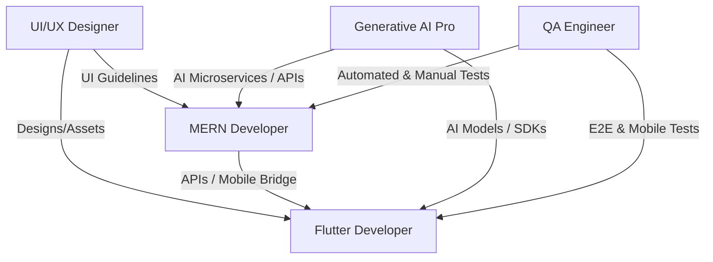

# 🎓 3-Month Software Engineering Internship & Training Plan

This training plan is designed for **5 Computer Science students** over a **3-month duration**. The curriculum is tailored around two active projects:
1. **SpaccaPOS**: A modern, real-time Coffee Shop Point-of-Sale (POS) system built using **React, Tailwind CSS v4, Node.js (Express), Drizzle ORM, and SQLite**.
2. **TradingPlatform**: A B2B e-commerce, logistics, and storage management marketplace built on **Laravel 11, SQLite, Blade, and Bootstrap/Tailwind**.

The plan emphasizes **cross-functional collaboration**, **modern engineering practices**, and **practical feature delivery** matching each student's specialization.

---

## 👥 Student Specialization Matrix

| Role | Student Specialization | Primary Project Scope | Key Technologies |
| :--- | :--- | :--- | :--- |
| **MERN Developer** | Professional MERN Stack | SpaccaPOS Backend APIs & Frontend Features; TradingPlatform API integrations | Node.js, Express, React, TypeScript, Drizzle ORM |
| **Mobile Developer** | Flutter App Developer | Mobile Customer Ordering & Merchant Dashboard Clients | Flutter, Dart, Riverpod/Bloc, Ktor/REST API Client |
| **UI/UX Designer** | UI/UX Professional Designer | High-fidelity UI designs, wireframes, user research, design systems, and visual polishing | Figma, Tailwind CSS guidelines, Adobe Creative Suite |
| **QA Engineer** | Software Testing Specialist | Unit, Integration, End-to-End (E2E), Performance, and Security testing suites | Vitest, PHPUnit, Playwright, K6, GitHub Actions |
| **GenAI Specialist** | Generative AI Professional | Smart natural language ordering, semantic search, automated description generators, demand forecaster | Gemini API, OpenAI API, Vector embeddings, Python/Node |

---

## 🔄 Cross-Functional Synergy (How They Work Together)

To simulate a professional product team, the students will operate using **Agile/Scrum** principles:
*   **The UI/UX Designer** works ahead of the developers, supplying wireframes and user flows.
*   **The MERN Developer** constructs the backend API endpoints (e.g., the SpaccaPOS Mobile Bridge API).
*   **The Flutter Developer** consumes these endpoints to build the mobile app.
*   **The GenAI Specialist** builds intelligent features (e.g., order parsing, content generation) that the developers integrate.
*   **The QA Engineer** continuously tests features built by both developers against the designer's requirements.

---

## 📅 Month 1: Onboarding, Architecture Mapping & Foundations

### 🎯 Overall Goals
*   Set up local development environments for both projects.
*   Understand git workflows, code reviews, and the technical architecture of both repositories.
*   Complete basic issues and write introductory tests.

---

### 💻 MERN Stack Developer
#### What They Will Work On:
*   Perform code walkthroughs of the SpaccaPOS `api-server` and `spacca-pos` repositories.
*   Enhance existing tables in SpaccaPOS (e.g., adding `activity-logs.ts` or user session trackers).
*   Implement simple CRUD operations on SpaccaPOS (e.g., managing Drink Categories or Stock Audits on the admin panel).
#### What They Will Learn:
*   Working with TypeScript, Drizzle ORM, and SQLite.
*   State management in React with `@tanstack/react-query` and component design using Tailwind CSS v4.

---

### 📱 Flutter App Developer
#### What They Will Work On:
*   Analyze the existing legacy Kotlin/Ktor codebase configuration (`spacca-android-` specs in `mobile_app_compatibility_analysis.md`).
*   Initialize the new cross-platform Flutter application structure.
*   Develop the app shell, router (AutoRoute/go_router), and primary landing screens (Category list, Product cards).
#### What They Will Learn:
*   Flutter project architecture, Clean Architecture patterns, and state management (Riverpod/Bloc).
*   Implementing clean HTTP networking layers in Dart using `Dio` or `http`.

---

### 🎨 UI/UX Professional Designer
#### What They Will Work On:
*   Audit the existing desktop interfaces of SpaccaPOS and TradingPlatform.
*   Create a **unified visual Design System** in Figma (color variables, typography scale, component definitions).
*   Begin wireframing the user journey for the **SpaccaPOS Mobile Customer App** (category selector, drink modifier sheet, checkout flow).
#### What They Will Learn:
*   Product design principles for POS and B2B systems.
*   Building responsive design components and translating them to Tailwind CSS variables.

---

### 🧪 Software Testing Specialist
#### What They Will Work On:
*   Configure the Vitest environment for SpaccaPOS `api-server`.
*   Write unit tests for existing business logic in SpaccaPOS (e.g., order pricing calculations, inventory deduction logic).
*   Review PHPUnit configurations in the TradingPlatform project.
#### What They Will Learn:
*   Unit testing concepts, mocking database sessions with Drizzle, and testing Laravel models/controllers with PHPUnit.

---

### 🤖 Generative AI Professional
#### What They Will Work On:
*   Set up LLM API integrations (Google Gemini API / OpenAI).
*   Develop a **Semantic QA Search prototype** for the TradingPlatform Knowledge Base (`knowledge_bases` and `faqs` tables).
*   Generate text embeddings for FAQ documents and test retrieval accuracy.
#### What They Will Learn:
*   Prompt engineering, working with embeddings, vector search principles, and integrating LLMs into Node/PHP applications.

---

## 📅 Month 2: Core Feature Implementation & Cross-Project Integrations

### 🎯 Overall Goals
*   Implement the core mobile compatibility bridge in SpaccaPOS backend.
*   Connect the Flutter App to the backend APIs.
*   Build AI-powered product description tools and interactive ordering systems.

---

### 💻 MERN Stack Developer
#### What They Will Work On:
*   Develop the **Mobile Bridge Router** inside SpaccaPOS (`api-server/src/routes/mobile-bridge.ts`) to adapt POS APIs for the Flutter application.
*   Create Drizzle migration schemas for stateful user carts: `carts` and `cart_items` tables.
*   Expose complex drink customizations (volumes, milk types, ingredient options) as attributes for the mobile client.
#### What They Will Learn:
*   Designing backwards-compatible API adapters, managing stateful user sessions, and writing migrations.

---

### 📱 Flutter App Developer
#### What They Will Work On:
*   Integrate the Flutter client with the newly built SpaccaPOS Mobile Bridge API.
*   Develop the **Dynamic Drink Modifier UI**: Render options dynamically based on API responses (e.g., sizes, milk modifications, extra shots).
*   Build the mobile Cart and Checkout screens, sending transactional order bodies to `POST /api/mobile/checkout/onepage/orders`.
#### What They Will Learn:
*   Dynamic form building in Flutter, stateful cart persistence, and synchronizing state across multiple screens.

---

### 🎨 UI/UX Professional Designer
#### What They Will Work On:
*   Complete high-fidelity mockups in Figma for both the Mobile Ordering app and the TradingPlatform's merchant dashboard (e.g., cold storage room allocations and transportation requests).
*   Deliver developer handoffs containing strict spacing, asset exports, and CSS code snippets.
*   Perform UI audits of the active React and Flutter builds.
#### What They Will Learn:
*   Professional developer handoff procedures, responsive layouts, and visual quality assurance.

---

### 🧪 Software Testing Specialist
#### What They Will Work On:
*   Set up **Playwright** inside SpaccaPOS to write E2E test suites covering cashier sign-ins, transaction flows, and stock adjustments.
*   Write automated integration tests for the Mobile Bridge API endpoints (`/products/getProductIdByOptions`, `/checkout/cart`, etc.).
#### What They Will Learn:
*   E2E testing methodologies, session state isolation in tests, and headless browser automation.

---

### 🤖 Generative AI Professional
#### What They Will Work On:
*   **TradingPlatform AI Merchant Assistant**: Integrate a tool where merchants input product names/attributes (e.g., fresh apples, 10 tons, refrigerated) and the AI automatically writes high-converting, SEO-optimized product descriptions and matches them to categories.
*   **SpaccaPOS AI Barista Assistant**: Create an Express endpoint that processes voice-to-text / text prompts (e.g., *"I want an iced large oat milk latte with double shot and low sugar"*) and parses it using structured JSON/tool calling into a valid cart payload.
#### What They Will Learn:
*   JSON schema enforcement with LLMs, function calling, audio/text transcription processing, and SEO keyword generation.

---

## 📅 Month 3: Optimization, Testing, Security & System Launch

### 🎯 Overall Goals
*   Conduct comprehensive testing (performance, security, usability).
*   Optimize database queries and finalize visual touches.
*   Assemble a working deployment pipeline and present the projects.

---

### 💻 MERN Stack Developer
#### What They Will Work On:
*   Performance tune SpaccaPOS API endpoints (add indices on SQLite tables, optimize database queries).
*   Collaborate with the GenAI specialist to hook the AI Barista Assistant endpoint directly into the React POS client.
*   Support final front-end refinements based on the designer's audits.
#### What They Will Learn:
*   Query profiling, indexing strategies, SSE (Server-Sent Events) event optimization, and front-end polishing.

---

### 📱 Flutter App Developer
#### What They Will Work On:
*   Implement local caching and offline-first support for catalog data using SQLite (sqflite) or Isar Database.
*   Polish micro-animations (transitions, hero animations, adding to cart animations).
*   Build and bundle the Android application (`.apk`) and iOS configurations for staging release.
#### What They Will Learn:
*   Offline state caching architectures, performance profiling, and mobile deployment configurations.

---

### 🎨 UI/UX Professional Designer
#### What They Will Work On:
*   Conduct usability testing sessions with real users (students/baristas) using the working mobile app and web clients.
*   Deliver final visual refinements, empty state screens, and loading skeletons.
*   Design high-quality visual presentation decks showcasing the team's achievements to the Communication Ministry.
#### What They Will Learn:
*   User testing methodologies, analyzing feedback loops, and corporate project presentation formatting.

---

### 🧪 Software Testing Specialist
#### What They Will Work On:
*   Perform API load/stress testing on SpaccaPOS and TradingPlatform using tools like **K6** or **Autocannon**.
*   Conduct basic security testing (vulnerability scans, input validation, SQL injection tests, XSS scripting checks).
*   Implement continuous testing integration pipelines in GitHub Actions (CI).
#### What They Will Learn:
*   Performance bottleneck identification, security sanitization checks, and CI/CD testing integration.

---

### 🤖 Generative AI Professional
#### What They Will Work On:
*   **AI Demand & Inventory Forecaster**: Analyze past sales, ingredient usage, and chronological patterns to predict future ingredient requirements for SpaccaPOS. Expose this as an admin warning banner.
*   Finalize AI agent integrations, optimizing tokens, latency, and caching prompts.
#### What They Will Learn:
*   Time-series data forecasting, basic data modeling, prompt caching optimizations, and latency reduction in LLM chains.

---

## 📊 Evaluation & Graduation Framework

To assess progress and ensure successful graduation, students will be evaluated against:

1.  **Weekly 1-on-1s & Sprint Reviews**: Checking completion of assigned issues.
2.  **Code Quality**: Evaluated through git pull request reviews (clean code, proper commits, and test coverage).
3.  **Cross-functional Collaboration**: How well they coordinate APIs, designs, and testing suites.
4.  **Final Project Showcase**: A live demonstration of the integrated SpaccaPOS (with AI ordering & Mobile app) and TradingPlatform (with AI Merchant tools & QA coverage) presented directly to stakeholders.

---

> [!IMPORTANT]
> **Suggested Mentorship Schedule:**
> *   **Daily Standup (15 mins)**: What did you do yesterday? What will you do today? Any blockers?
> *   **Bi-Weekly Sprints (2 weeks)**: Review completed work and plan tasks for the next 2 weeks.
> *   **Code Reviews**: No code goes to the main branch without peer review and QA sign-off.
